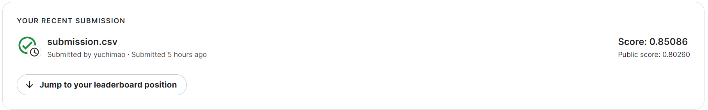
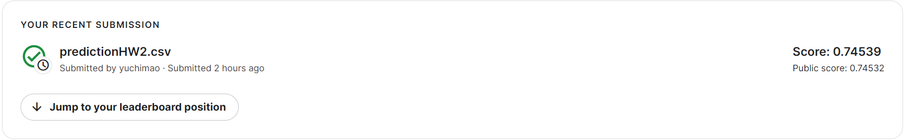
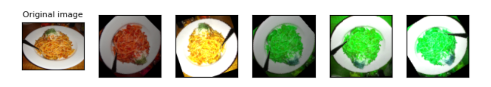
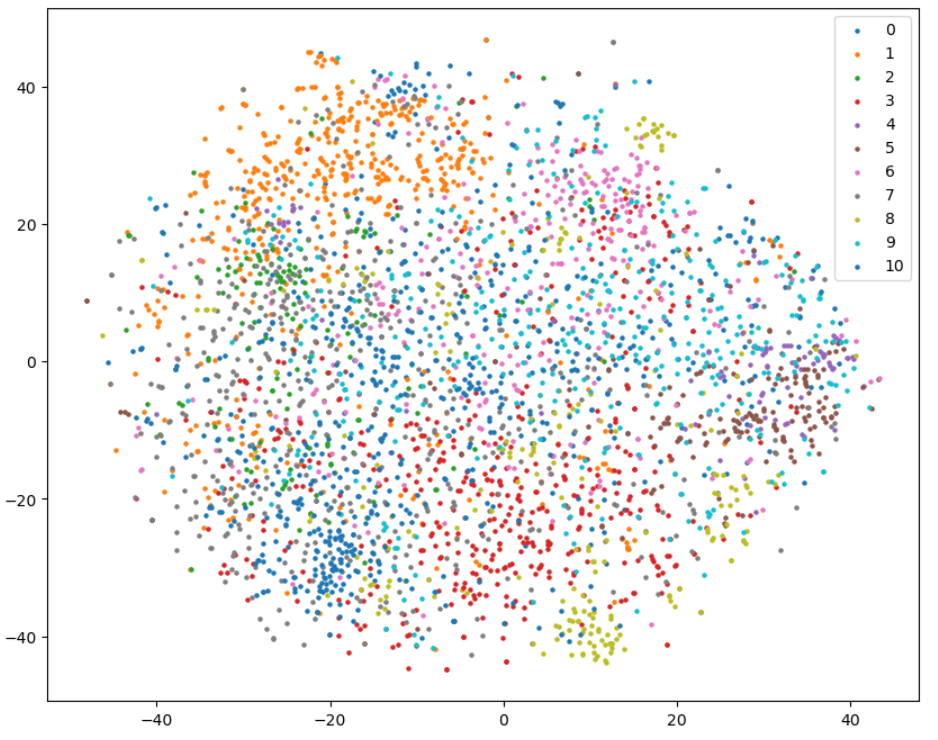
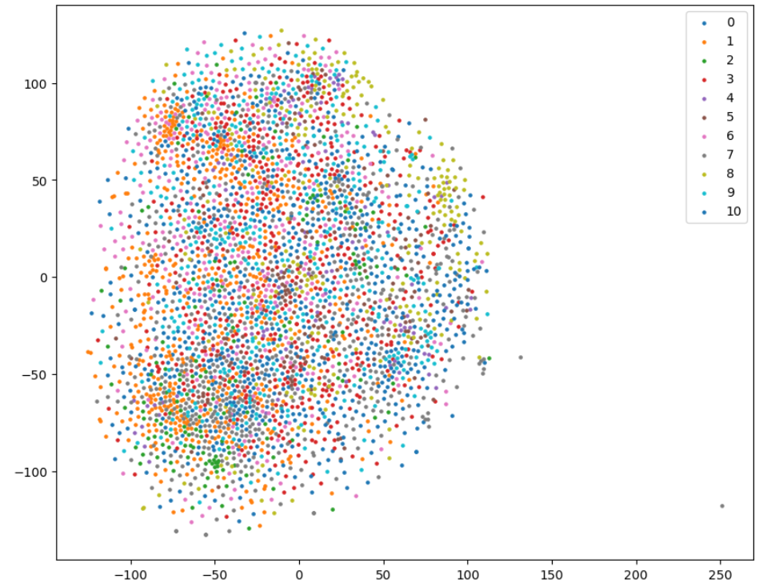
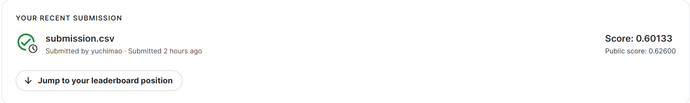
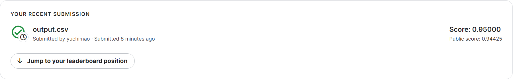
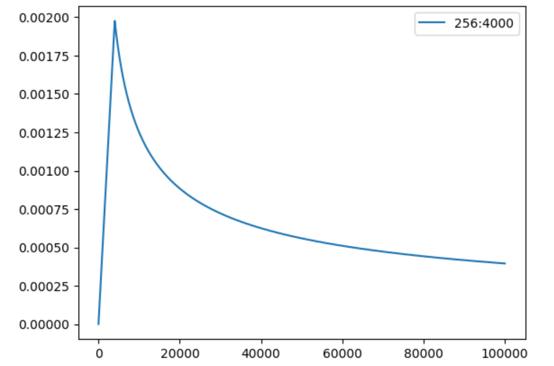

# HW01  COVID-19 Cases Prediction

> Objectives:
>
> 1. Solve a regression problem with deep neural networks (DNN).
> 2. Understand basic DNN training tips.
> 3. Familiarize yourself with PyTorch.

- 一个回归模型，情景是COVID-19调查问卷，根据受访者的前两天对于问卷的填写情况以及确诊情况，预测第三天的确诊概率

  - 问卷的col有states、covid-like 症状、心理症状等等。其中states使用one-hot编码

- 此次作业的关键在于学会基础的DNN模型，全部由fully-connected-layer组成。此外获得了很多关于调参的认知

  - 使用了skl库进行feature的筛选。比起人工按照理解筛选，该库更能方便地实现feature筛选
    - feature适量为好，全选效果差
  - 参考的代码还使用了optuna进行hyper-parameter寻优，但是感觉效果不理想
    - seed、lr都算比较重要的超参
  - 更换了torch提供的optimizer，使用Adam，发现默认learning rate = 0.001 是相对最好的

- 总之是了解了DNN的基本结构，对于pytorch架构有了基本认知

  - 此外还对一些python在DL中的写法规范有了认知
  - kaggle score 在strong baseline附近，较为普通的成绩，合格地掌握HW1

- model 部分的代码

  ```python
  class My_Model(nn.Module):
      def __init__(self, input_dim):
          super(My_Model, self).__init__()
          # TODO: modify model's structure, be aware of dimensions. 
          self.layers = nn.Sequential(
              nn.Linear(input_dim, config['layer'][0]),  # 这样处理是为了更方便调参
              nn.ReLU(),   # 进行ReLU
              nn.Linear(config['layer'][0], config['layer'][1]),  # 第二层，线性组合出layer[1]个神经元
              nn.ReLU(),   # 进行ReLU
              nn.Linear(config['layer'][1], 1)  # 第三层，输出层
          )
  
      def forward(self, x):
          x = self.layers(x)
          x = x.squeeze(1) # (B, 1) -> (B)
          return x
  ```




# HW02 Phoneme Classification

> Objectives:
>
> 1. Solve a classification problem with deep neural networks (DNNs).
> 2. Understand recursive neural networks (RNNs).

- 一个分类模型，将语音切分为一个个小的frame，然后识别分类到41个phoneme

  - 数据预处理的部分已经由sample code 做好，只需要train model就好

  - 由于是语言问题，使用RNN的效果会好很多，此处没有使用RNN，仅训练了一个更大的DNN模型

  - model 参数情况(Total params: 1953833)

    ```python
    # data prarameters
    concat_nframes = 31              # the number of frames to concat with, n must be odd (total 2k+1 = n frames)
    train_ratio = 0.9              # the ratio of data used for training, the rest will be used for validation
    
    # training parameters
    seed = 1213                        # random seed
    batch_size = 512                # batch size
    num_epoch = 15                   # the number of training epoch
    learning_rate = 1e-3         # learning rate
    model_path = './model.ckpt'     # the path where the checkpoint will be saved
    
    # model parameters
    input_dim = 39 * concat_nframes # the input dim of the model, you should not change the value
    hidden_layers = 6               # the number of hidden layers
    hidden_dim = 512                # the hidden dim
    ```

    

- model 部分代码

  ```python
  import torch.nn as nn
  
  class BasicBlock(nn.Module):
      def __init__(self, input_dim, output_dim):
          super(BasicBlock, self).__init__()
  
          self.block = nn.Sequential(
              nn.Linear(input_dim, output_dim),
              nn.BatchNorm1d(output_dim),
              nn.ReLU(),
              # 在此处增加 nn.Dropout()
              nn.Dropout(p=0.15)
          )
  
      def forward(self, x):
          x = self.block(x)
          return x
  
  
  class Classifier(nn.Module):
      def __init__(self, input_dim, output_dim=41, hidden_layers=4, hidden_dim=256):
          super(Classifier, self).__init__()
  
          self.fc = nn.Sequential(
              BasicBlock(input_dim, hidden_dim),
              # 这一行代码是列表推导，最终的表现是重复生成多个 hidden layer（算上上一行代码的那层）
              # 这段代码将生成hidden_layers个隐藏层
              *[BasicBlock(hidden_dim, hidden_dim) for _ in range(hidden_layers-1)],
              nn.Linear(hidden_dim, output_dim)
          )
  
      def forward(self, x):
          x = self.fc(x)
          return x
  ```

  多分类问题会在最后加一个softmax activate function，这已经被torch集成到它的crossEntrpy里面了（只要loss选crossEntrpy就会在最后加上softmax）

  

- 总之对DNN解决分类问题有了大致认知，同时该模型参数较多，约200万。若无脑再叠epoch和hidden layer的dim可能会有更好地结果。（kaggle 提供的ram 爆了




# HW03 Image Classification

> Objectives:
>
> 1. Use CNN for image classification.
> 2. Implement data augmentation
> 3. Visualize the learned visual representations of the CNN model on the validation set by implementing t-SNE
> 4. Implement Cross Validation \+ Ensemble

- 将事物的图片分成十一类，使用CNN模型

  ```python
  class Classifier(nn.Module):
     def __init__(self):
         super(Classifier, self).__init__()
         # torch.nn.Conv2d(in_channels, out_channels, kernel_size, stride, padding)
         # torch.nn.MaxPool2d(kernel_size, stride, padding)
         # input 維度 [3, 128, 128]
         self.cnn = nn.Sequential(
             nn.Conv2d(3, 64, 3, 1, 1),  # [64, 128, 128] 其中3,1,1分别指的kernel大小，stride，padding
             nn.BatchNorm2d(64),
             nn.ReLU(),
             nn.MaxPool2d(2, 2, 0),      # [64, 64, 64] 
            
  
             nn.Conv2d(64, 128, 3, 1, 1), # [128, 64, 64]
             nn.BatchNorm2d(128),
             nn.ReLU(),
             nn.MaxPool2d(2, 2, 0),      # [128, 32, 32]
           
             nn.Conv2d(128, 256, 3, 1, 1), # [256, 32, 32]
             nn.BatchNorm2d(256),
             nn.ReLU(),
             nn.MaxPool2d(2, 2, 0),      # [256, 16, 16]
  
             nn.Conv2d(256, 512, 3, 1, 1), # [512, 16, 16]
             nn.BatchNorm2d(512),
             nn.ReLU(),
             nn.MaxPool2d(2, 2, 0),       # [512, 8, 8]
             
             nn.Conv2d(512, 512, 3, 1, 1), # [512, 8, 8]
             nn.BatchNorm2d(512),
             nn.ReLU(),  
             nn.MaxPool2d(2, 2, 0),       # [512, 4, 4]
         )
         self.fc = nn.Sequential(
             nn.Dropout(0.4),
             nn.Linear(512*4*4, 1024),
             nn.ReLU(),
             nn.Linear(1024, 512),
             nn.ReLU(),
             nn.Linear(512, 11)
         )
  
     def forward(self, x):
         out = self.cnn(x)
         out = out.view(out.size()[0], -1)
         return self.fc(out)
  ```

  

- 通过 `torchvision.transforms` 实现data augmentation

  ```python
  train_tfm = transforms.Compose([
      transforms.Resize((128, 128)),
      transforms.RandomHorizontalFlip(0.5),
      transforms.RandomVerticalFlip(0.5),
      transforms.RandomRotation(50),
      transforms.GaussianBlur(3, 0.1),
      transforms.ColorJitter(brightness=0.5, hue=0.3),
      transforms.ToTensor(),
      # ToTensor() should be the last one of the transforms.
  ])
  ```

  [ CSDN：torchvision.transforms 常用方法解析](https://blog.csdn.net/weixin_42426841/article/details/129903800)

  augmentation效果：

- 通过t-SNE降维可视化解释模型分类效果

  **top层（FC层前的最后一层）**

  

  **mid层（CNN中的中间层）**

  

  可见top layer 比 mid layer 的分类效果明显很多，top层中，相同颜色的点代表相同类的样本，冒险可以看出有聚集的趋势，并且可以通过两类样本或个别样本的距离解释相似程度。

- 使用k - fold cross  validation \+ Ensemble 可以提高模型的稳定性。此HW中我使用了4折，train出了4个model，最终是使用的简易的vote机制来确定结果。由于模型对每个样本给出的一个概率分布序列，我采取的是将4个分布叠加起来后再取分布中的最大值当做prediction。最后的结果并不理想，在于每个model的结果都较差，ensemble并没有得到很好的体现，但是由于train的时间太长了，只跑了15个epoch就要2h，4-fold 就是4倍的时间。最终放弃刷榜。

  


# HW04 Speaker Identification

> Objectives:
>
> 1. Know how to use Transformer.
> 2. Predict speaker class from given speech

- HW04 也是一个分类，通过大量处理后的音频对600个speaker进行分类。由于在输入时会处理一段连续的语音，这里就使用到了transformer的encoder部分，output部分还是分类


- model部分如下：

  ```python
  class Classifier(nn.Module):
  	def __init__(self, d_model=224, n_spks=600, dropout=0.2):
  		super().__init__()
  		# Project the dimension of features from that of input into d_model.
  		self.prenet = nn.Linear(40, d_model)
  		self.encoder_layer = nn.TransformerEncoderLayer(
  			d_model=d_model, dim_feedforward=448, nhead=2, dropout=dropout
  		)
  		self.encoder = nn.TransformerEncoder(self.encoder_layer, num_layers=3)
  		# Project the the dimension of features from d_model into speaker nums.
  		self.pred_layer = nn.Sequential(
              nn.BatchNorm1d(d_model),
  			nn.Linear(d_model, d_model),
  			nn.ReLU(),
  			nn.Linear(d_model, n_spks),
  		)
  
  	def forward(self, mels):
  		"""
  		args:
  			mels: (batch size, length, 40)
  		return:
  			out: (batch size, n_spks)
  		"""
  		# out: (batch size, length, d_model)
  		out = self.prenet(mels)
  		# out: (length, batch size, d_model)
  		out = out.permute(1, 0, 2)
  		# The encoder layer expect features in the shape of (length, batch size, d_model).
  		out = self.encoder(out)
  		# out: (batch size, length, d_model)
  		out = out.transpose(0, 1)
  		# mean pooling
  		stats = out.mean(dim=1)
  		# out: (batch, n_spks)
  		out = self.pred_layer(stats)
  		return out
  ```

  输入的语音信号经过一个预处理网络（prenet）得到一个特征矩阵，其中包含了语音信号的频谱信息。接着，将特征矩阵转置成编码器（encoder）期望的形状（即长度、批次和特征维度的顺序），并将其输入到编码器中。编码器将特征矩阵转换为一个上下文向量序列，其中每个上下文向量都包含了输入序列中一个位置的信息。然后，将上下文向量序列再次转置回原来的顺序，并对每个批次中的所有上下文向量进行 mean pooling，得到一个表示整个语音信号的统计量。最后，将这个统计量输入到一个FC layer中，得到预测的speaker label。


- 课程给出了优化思路，包括将transformer改成conformer（结合CNN），对pooling技术继续更改等等，我在HW04中只实现了基本的transformer model，并进行了一些调参。 最终结果如图

  


# HW05 Machine Translation

> Objectives:
>
> 1. English to Chinese (Traditional) Translation
>    - Input: an English sentence  (e.g. tom is a student .)
>    - Output: the Chinese translation  (e.g. 湯姆 是 個 學生 。)
> 2. Train a transformer seq2seq to achieve translation 
> 3. Adopt warm-up learning rate schedule
- 本HW资料来自ted2020演讲中英字母对照，在train的前期有大量的数据预处理的工作，并且依赖 `fairseq` package

- 采用 transformer 的 seq2seq model 架构如下

  ```python
  class Seq2Seq(FairseqEncoderDecoderModel):
      def __init__(self, args, encoder, decoder):
          super().__init__(encoder, decoder)
          self.args = args
      
      def forward(
          self,
          src_tokens,
          src_lengths,
          prev_output_tokens,
          return_all_hiddens: bool = True,
      ):
          """
          Run the forward pass for an encoder-decoder model.
          """
          encoder_out = self.encoder(
              src_tokens, src_lengths=src_lengths, return_all_hiddens=return_all_hiddens
          )
          logits, extra = self.decoder(
              prev_output_tokens,
              encoder_out=encoder_out,
              src_lengths=src_lengths,
              return_all_hiddens=return_all_hiddens,
          )
          return logits, extra
  ```

- model Initialization 过程如下，其中关键的 `TransformerEncoder & TransformerDecoder ` 都是直接导入的

  ```python
  from fairseq.models.transformer import (
      TransformerEncoder, 
      TransformerDecoder,
  )
  
  def build_model(args, task):
      """ build a model instance based on hyperparameters """
      src_dict, tgt_dict = task.source_dictionary, task.target_dictionary
  
      # token embeddings
      encoder_embed_tokens = nn.Embedding(len(src_dict), args.encoder_embed_dim, src_dict.pad())
      decoder_embed_tokens = nn.Embedding(len(tgt_dict), args.decoder_embed_dim, tgt_dict.pad())
      
      # encoder decoder
      encoder = TransformerEncoder(args, src_dict, encoder_embed_tokens)
      decoder = TransformerDecoder(args, tgt_dict, decoder_embed_tokens)
  
      # sequence to sequence model
      model = Seq2Seq(args, encoder, decoder)
      
      # initialization for seq2seq model is important, requires extra handling
      def init_params(module):
          from fairseq.modules import MultiheadAttention
          if isinstance(module, nn.Linear):
              module.weight.data.normal_(mean=0.0, std=0.02)
              if module.bias is not None:
                  module.bias.data.zero_()
          if isinstance(module, nn.Embedding):
              module.weight.data.normal_(mean=0.0, std=0.02)
              if module.padding_idx is not None:
                  module.weight.data[module.padding_idx].zero_()
          if isinstance(module, MultiheadAttention):
              module.q_proj.weight.data.normal_(mean=0.0, std=0.02)
              module.k_proj.weight.data.normal_(mean=0.0, std=0.02)
              module.v_proj.weight.data.normal_(mean=0.0, std=0.02)
          if isinstance(module, nn.RNNBase):
              for name, param in module.named_parameters():
                  if "weight" in name or "bias" in name:
                      param.data.uniform_(-0.1, 0.1)
              
      # weight initialization
      model.apply(init_params)
      return model
  ```

  

- 研究证明，warm-up learning rate schedule 对于 train transformer model 有较好的表现

  ```python
  def get_rate(d_model, step_num, warmup_step):
      # TODO: Change lr from constant to the equation shown above
      lr = (d_model**(-0.5)) * min(step_num**(-0.5), step_num*(warmup_step**(-1.5)))
      return lr
  ```




- 翻译结果展示

  ```
  en:Just to give you a hint of that, let's look back at that OECD graph that we were talking about.
  my model zh:給你一個暗示 , 讓我們回頭看看我們剛剛提到的oecd圖表 。
  google zh:只是為了給你一點暗示，讓我們回顧一下我們正在談論的經合組織圖表。
  
  en:We need a framework to learn how to be more mindful.
  my model zh:我們需要一個架構來學習如何更謹慎 。
  google zh:我們需要一個框架來學習如何更加專注。
  
  en:And switching to a new Republican Calendar with ten-day weeks reduced church power by eliminating Sundays.
  my model zh:換到新共和黨的日曆 , 週日的十天 , 透過消除教堂權力 , 減少了教堂權力 。
  google zh:並改用新的共和黨曆法，每週十天，通過取消星期日來削弱教會的權力。
  
  en:Now it turns out, we are extremely stereotypical.
  my model zh:結果發現 , 我們是非常刻板印象的 
  google zh:現在事實證明，我們非常刻板。
  
  en:So we'd really want to see the Panama leaks, this huge peek into the offshore world, be used as a way of opening up in the US and around the world.
  my model zh:所以, 我們真的很想看到巴拿馬漏洞, 這個巨大的peek進入海外世界, 被用來當作一種在美國和世界各地開放的方式。
  google zh:所以我們真的很想看到巴拿馬洩密事件，這種對離岸世界的巨大窺視，被用作在美國和世界各地開放的一種方式。
  
  en:It seems only a few hundred of them have been shared with journalists so far.
  my model zh:目前為止 , 只有幾百名記者和記者分享 。
  google zh:到目前為止，似乎只有幾百個已與記者分享。
  ```

  可以看到机翻效果还是很不错的，第一句中 `OECD` 或许是因为没有足够多的语料没翻译出来，在遇到一些复杂句型比如第三句时，该model就表现较差。第四句就更加困难，peek是生僻意，且原句带有修辞，该model就表现较差。第五句中的them无上下文关联，被，model 推测为记者。


